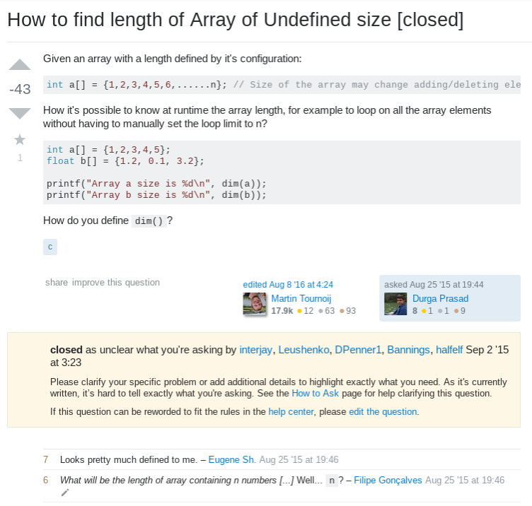
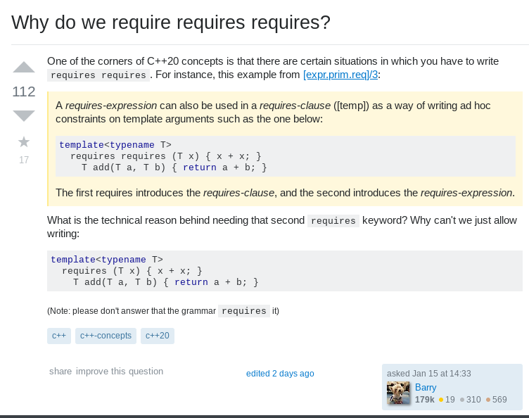
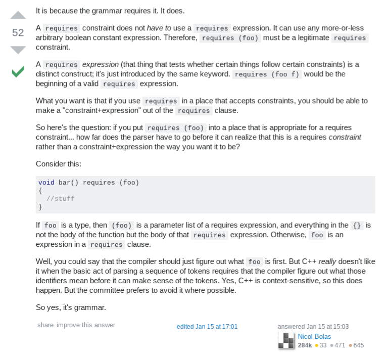

<h2>Asking the Right Question  </h2>

  It’s true what they say, there is no such thing as a stupid question.  There are, however, stupid times, places, and situations to ask a question.  For the most part, that’s fairly common sense; but getting these wrong will make a good question look like a dumb question immediately.  I wouldn’t ask my mechanic what ointment I should apply to a rash; just like I wouldn’t ask my doctor if he thinks that ‘rattling noise’ my car is making is being caused by worn-out suspension or a loose timing belt.  If I had asked those questions, I would expect to be met with confusion or derision.  The same logic can be applied to asking questions on the internet; but knowing what, where, and when to ask questions will help make sure they’re the right question for the situation.

<h2>Engineering Whos, Whats, Wheres, and Whens into Hows</h2>

  Engineering is about asking questions.  It is a field developed entirely by the curious and determined - those who want real answers to all sorts of questions.  Engineering is the “how” to many of humanity’s “whats.”  So any good engineer is asking questions and finding solutions.  Part of finding solutions, however, is asking “smart” questions.  Questions which are appropriate for time, place, and especially audience.  Given the level of access the internet gives us to one another, it can be tempting to just go to any relevant online forum with a question, and start asking people for answers.  However, this may actually be counterproductive for an engineer for a few reasons.  In many instances, a question has already been asked and running the query through a search engine would provide more immediate results.  Another complication may be that the engineer does not have a thorough enough understanding of their own question; in this case, their question may be confusing for others due to things like poor reasoning or lack of required information.  Worst of all, low-effort or basic questions may be met with outright derision; for example:

  Again, it isn’t that the question itself was “dumb” - understanding how to declare, iterate, and utilize arrays is critical to coding.  However, in this case, the question is either so simple that its answer is fundamentally basic to arrays, and could be easily found by utilizing a search engine or simply reading any guide on the code; or it is much more complicated than it seems, and too little information was provided to give any clear answer.  Presuming it was the former, a few internet searches would likely have yielded near-immediate results.  Consequently, if you click the image and scroll down, even those few saints who actually attempted at to a solution - despite the nature of the question - took at least a day to respond.  
	
<h2>Getting Answers</h2>

  Even though the vast majority of questions can be answered by utilizing available resources, some questions are much more complicated.  Some answers may not be clear even given the relevant learning resources.  Or someone else may be better suited to make certain connections in the material.  An engineer could exhaust their usual references and then some, and still be stuck without an answer; and so insight from other professionals can be incredibly helpful.  However, when seeking help, the engineer should seek to help their helper by being as versed as possible in their own question.  Making no attempt to answer the question themselves provides potential helpers with no reference point by which to offer assistance; or just as likely, the asker won’t understand the answer even after it is given to them.  Asking “smart” questions in this fashion is a sure way for an engineer to be successful because doing so requires them to seek the answer on their own in order to better inform their own question.  This doesn’t require a question to be excessively complicated or tedious either.  Part of having a question be informed is that it can be as clear and concise as possible, while still containing all relevant information; for instance:

  This question about programming syntax is not especially complicated.  It is stated clearly and a clear reason for the question is given - in this case, curiosity.  The person asking displays their understanding of the syntax in question.  They also provided a source to their reference material with a specific snippet directly related to their question.  However, they’re still confused.  This individual is seeking to understand the reason as to why this syntax is used the way it is.  The answer to that question involves language design, and may be a bit out of this coder's scope; in this case, the coder knows the 'how' and the 'what' behind their question, but not the 'why.' The asker also asked the question in an intriguing manner.  It is a "smart" question, and the community responds in kind:

Other answers to this question were similarly detailed and helpful - and they also came back nearly immediately.  This contrast between the given examples stands to support the argument that, “smart” questions yield solutions.    

<h2>With All Due Respect</h2>

Aside from the nature of the question itself, the tone of a question is critical.  Consider the doctor metaphor: even if I am going to ask my doctor a ridiculously irrelevant question, I’m going to call them Doctor while I do it; because it does no good to be a moron AND a jerk.  Here again, the same rule applies online.  Just because we’re dealing with avatars instead of faces, doesn’t mean we aren’t still dealing with people.  Reacting to negative responses to questions by being rude or insulting does nothing for finding answers, and may be viewed by the community as a transgression.  A poor question followed-up by a poor attitude will guarantee the question goes nowhere.  However, responding constructively by fine-tuning the question or clarifying key points shows the asker is willing to learn and capable of collaboration.  Sometimes it is less about the mistake and more about the recovery.  Acknowledging a mistake and learning from it is far more respectable than starting a "flame war" because of 'hurt' feelings.  The best bet is to only ask "smart" questions as often as possible.
