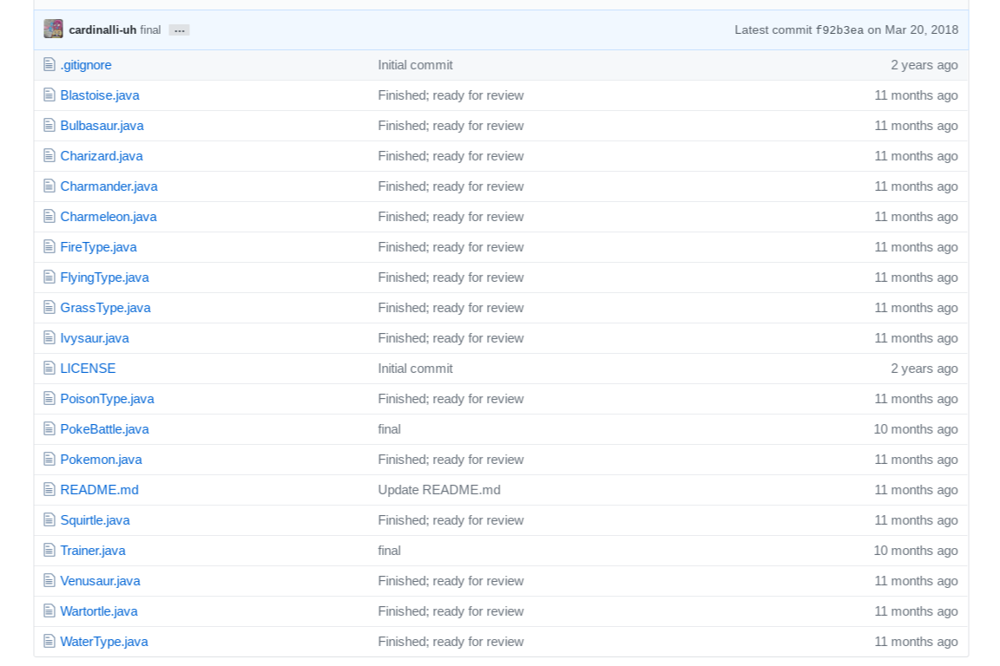

This is a simple text-based battle simulator I created for a college class, using the programming language Java.  The simulator is modeled after the Pokemon videogames.  Each player chooses a monster to command in battle.  When the ‘hit points’ of a player’s monster reaches zero, the other player wins.  The code isn’t terribly complicated; however, I was proud of it at the time because I was able to implement it with a single method-call from the main method; as such, it is a good example of modularity in code.

The program starts by creating two players, called ‘Trainers’ - after the Pokemon games.  The Trainers are from the class called Trainer, which I also created for this simulator; a Trainer starts with a name, and a pokemon. The game starts by letting each trainer select their monster from a list of available monsters.  Once both players have chosen a monster, they may battle them against one another.  A coin is flipped to determine who goes first.  During battle, a Trainer may command their monster to attack, or pass.  After three passes, the monster may use a special attack.  Additionally, each monster is associated with a ‘type.’  Certain types of monster are more powerful, or less powerful, when attacking or defending against certain other types; for example, an attack by a monster of ‘water’-type will be more powerful against a monster of ‘fire’-type.  The battle ends if at any point, one monster has its ‘hit points’ reduced to zero.  At which point, the winner is announced and the game ends.  The simulation requires many classes which represent the monsters and their types.  Some monsters are extensions of other monsters; and all monsters are ultimately extensions of the abstract class 'Pokemon.java.'  While the bulk of the abstract class, and the code for one monster, were provided as templates - all the other monsters, and the subclassing, had to be implemented by myself. Likewise, the types themselves were provided, but all the code that affects their role in the battle simulator was written by me.

While it wasn't my initial plan to implement this program so succinctly, I finished the assignment's requirements relatively quickly; and wanted to challenge myself to make the main method as clean as possible.  It was also the first project that required the incorporation of more than a handful of outside classes.  
  
 

